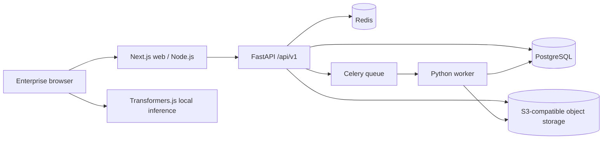

# Foundation architecture

## Responsibility boundaries

- Next.js owns presentation, browser capability detection and a thin API client.
- FastAPI owns authorization, domain rules, orchestration and auditability.
- Python workers own ingestion, catalog analysis, report generation and bounded AI jobs.
- PostgreSQL is the authoritative system of record.
- Redis is transient queue/cache infrastructure, never the sole source of business state.
- Object storage retains imports, snapshots and generated artifacts.
- Browser-side intelligence runs only after explicit user action and is not trusted for final enterprise metrics.

## Trust boundaries

1. Browser input is untrusted.
2. Product content imported from third-party storefronts is untrusted.
3. AI output is untrusted until schema validation and human approval.
4. Every workspace-scoped query must prove membership on the server.
5. Secrets remain server-side and are redacted from structured logs.
