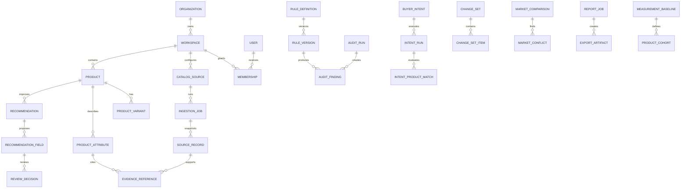

# Canonical domain model

Catora separates external source snapshots from normalized catalog intelligence.

## Value states

Catalog fields distinguish `missing`, `unknown`, `not_applicable`, `conflicting` and `present`. These states are not interchangeable.

## Identity

- Internal IDs are UUIDs.
- External IDs remain scoped to their source.
- SKU is searchable but never assumed globally unique.
- A product may be linked across markets while retaining market-specific copy, price, availability and URLs.

## Deletion policy

Storefronts, sources, products and variants may be soft deleted. Source records, evidence, audits, findings, recommendations, review decisions, change sets, reports and audit events remain historical until a governed retention process removes them.
